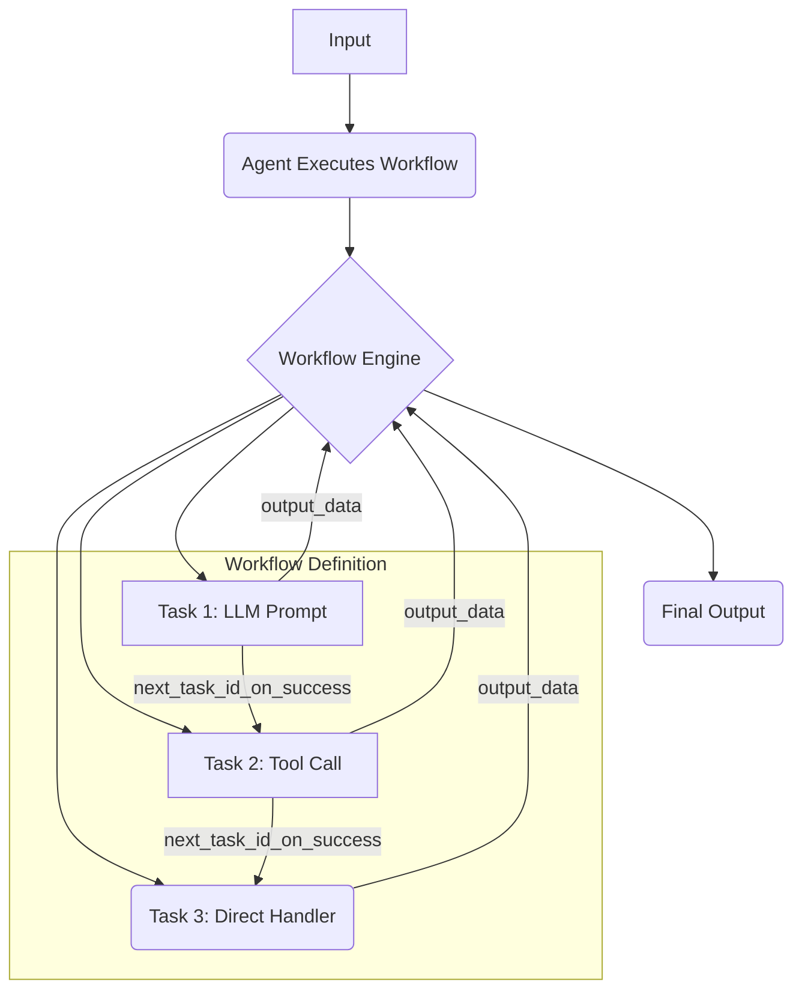
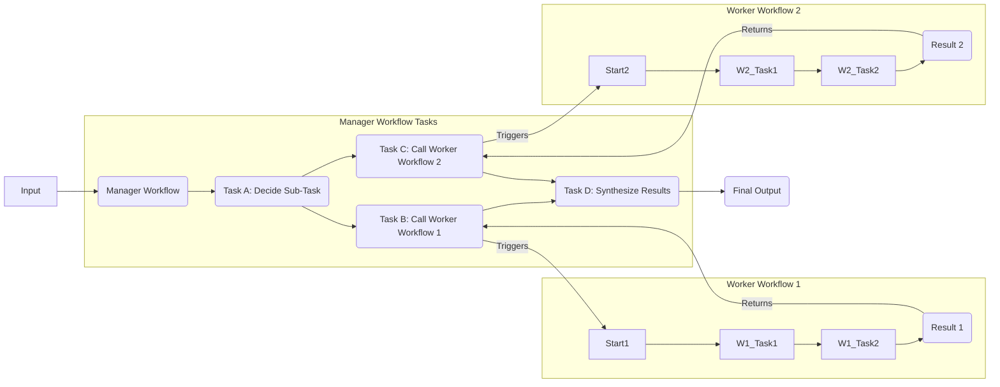
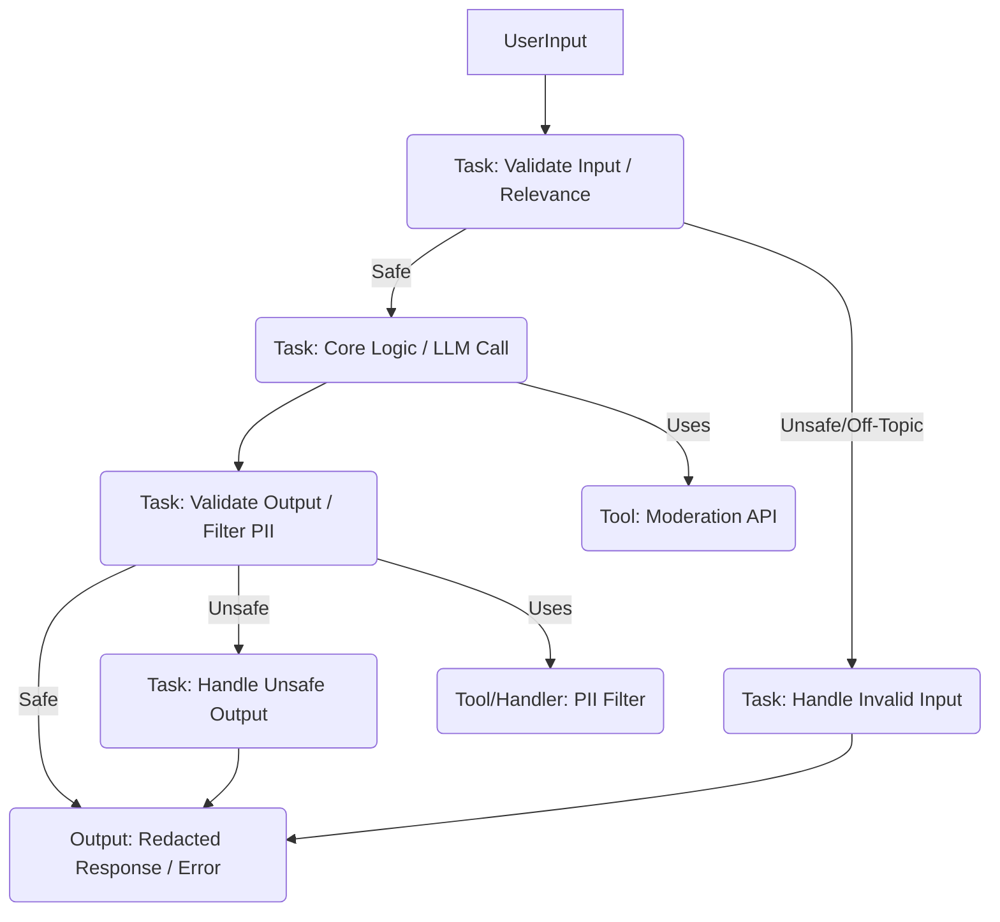

**(Cover Page - Conceptual)**

**Dawn Framework**

**A Practical Guide to Building Agents**

**(Image: Abstract representation of interconnected nodes/tasks)**

---

**(Page 2 - Contents)**

**Contents**

* What is an agent in Dawn?........................................... 4
* When should you build an agent with Dawn?......................... 5
* Agent Design Foundations (Dawn).................................... 7
  * LLM Interface................................................... 8
  * Tools and Handlers.............................................. 9
  * Workflows and Instructions..................................... 11
* Selecting your LLM Models........................................... 13
* Defining Tools and Handlers......................................... 14
* Configuring Prompts (Task Instructions)........................... 17
* Orchestration with Dawn Workflows................................... 19
  * Single Workflow Systems......................................... 20
  * When to Consider Multiple Workflows............................. 22
  * Multi-Workflow Systems (Manager Pattern)........................ 23
* Implementing Guardrails in Dawn..................................... 25
* Conclusion.......................................................... 28
* More Resources...................................................... 29

---

**(Page 3 - Introduction)**

**Introduction**

Large language models (LLMs) are increasingly capable of complex reasoning, understanding context, and interacting with external systems. The Dawn framework provides a structured and robust platform for harnessing these capabilities to build **agents**: systems that can autonomously execute multi-step workflows to achieve specific goals.

Dawn's core strength lies in its explicit **Workflow Management System (WMS)**, which allows developers to define, manage, and monitor complex task sequences involving LLMs, custom tools, and conditional logic.

This guide is designed for product and engineering teams exploring how to build their first agents using the Dawn framework. It distills practical insights and best practices, covering:

* Frameworks for identifying suitable use cases.
* Clear patterns for designing agent logic using Dawn's `Workflow` and `Task` objects.
* Best practices for integrating tools, handlers, and LLM prompts.
* Strategies for implementing safety guardrails within the Dawn structure.

After reading this guide, you'll have the foundational knowledge to confidently start building reliable and effective agents with the Dawn framework.

---

**(Page 4 - What is an agent in Dawn?)**

**What is an agent in Dawn?**

While conventional software often requires users to manually orchestrate steps, agents built with Dawn can execute complex, multi-step processes with a higher degree of autonomy on the user's behalf, guided by an explicit workflow definition.

> **Agents (in Dawn) are systems driven by an explicit Workflow, leveraging LLMs and Tools to accomplish defined tasks.**

A **Workflow** in Dawn is a sequence or graph of **Tasks**. Each Task represents a unit of work, potentially involving an LLM call or the execution of a specific tool or handler function. The **Workflow Engine** manages the execution state, dependencies, and transitions between these tasks.

Applications that simply integrate LLMs for single-turn responses (like simple chatbots or classifiers) without managing a multi-step process via a defined workflow are generally *not* considered full agents in the Dawn context.

More concretely, a Dawn agent possesses core characteristics:

1. **Workflow-Driven Execution:** It operates based on a defined `Workflow` consisting of `Task` objects. The `WorkflowEngine` manages task execution, state, dependencies, and conditional branching.
2. **LLM for Reasoning/Generation:** It leverages an `LLMInterface` within specific `Task` definitions (where `is_llm_task=True`) to perform reasoning, analysis, content generation, or decision-making based on task inputs and context.
3. **Tools and Handlers for Action:** It interacts with the external world or performs specific logic via:
    * **Tools:** Reusable functions registered in the `ToolRegistry` (e.g., `web_search`, `save_to_ltm`, custom API calls).
    * **Direct Handlers:** Python functions executed directly by `DirectHandlerTask` objects for workflow-specific logic (e.g., parsing, validation, custom transformations).
4. **State Management:** The `WorkflowEngine` implicitly manages the state of tasks (pending, running, completed, failed) and allows data (`output_data`) to flow between dependent tasks via variable resolution (`${task_id.output_data...}`).

---

**(Page 5 & 6 - When should you build an agent with Dawn?)**

**When should you build an agent with Dawn?**

Building agents with Dawn requires thinking explicitly about process flow, task decomposition, and state management. Dawn is particularly well-suited for automating processes where traditional deterministic approaches fall short or become overly complex.

Consider the example of compliance checking. A traditional rules engine might use a massive, hard-to-maintain checklist. In contrast, a Dawn agent could implement this as a workflow:

1. A task extracts key elements from an input document/description.
2. Parallel tasks use `file_search` (RAG) against different compliance documents (SOC2, GDPR) stored in Vector Stores.
3. An LLM task synthesizes the findings from the searches against the extracted elements.
4. A `DirectHandlerTask` evaluates the LLM synthesis to determine a risk level.
5. Conditional tasks log the result or escalate to a human based on the risk level.

Dawn's explicit structure makes managing such multi-step, context-dependent processes more reliable and maintainable.

Prioritize building agents for workflows that have resisted traditional automation, especially where you encounter:

1. **Complex Decision-Making & Logic:**
    * Workflows requiring nuanced judgment based on multiple data points, involving conditional paths, retries, or feedback loops.
    * *Example:* Routing a complex customer support ticket based on sentiment, keywords, and customer history, potentially involving multiple lookups and an LLM analysis step.

2. **Brittle or Hard-to-Maintain Rule Systems:**
    * Processes currently governed by extensive, complex, and error-prone rule engines or scripts. Dawn's explicit `Task` and `Workflow` structure can provide clarity and easier updates.
    * *Example:* Replacing a legacy script for generating personalized marketing emails with a workflow involving data fetching, LLM-based content generation, and conditional sending logic.

3. **Heavy Reliance on Unstructured Data or External Knowledge:**
    * Scenarios needing interpretation of natural language, extraction from documents (RAG), or interaction with external APIs/web searches.
    * *Example:* An agent that monitors news feeds (web search tool), extracts relevant articles based on user criteria (LLM task), searches internal documents for context (file search tool), and generates summaries (`write_markdown` tool).

Before committing to building a Dawn agent, validate that your use case clearly benefits from this structured, multi-step approach. For very simple, single-step tasks, a direct LLM call or a simpler script might suffice.

---

**(Page 7 - Agent Design Foundations)**

**Agent Design Foundations (Dawn)**

In its most fundamental form, a Dawn agent system consists of these core components managed by the framework:

1. **LLM Interface (`core.llm.interface.LLMInterface`)**
    * The connection to the LLM (e.g., OpenAI API client) used for reasoning and generation within specific tasks. Configured via `core.config`.
2. **Tools & Handlers (`core.tools.registry`, `core.task.DirectHandlerTask`)**
    * **Tools:** Reusable external functions or APIs registered in the `ToolRegistry`.
    * **Handlers:** Python functions executed directly via `DirectHandlerTask` for workflow-specific logic.
3. **Workflow & Task Instructions (`core.workflow.Workflow`, `core.task.Task`)**
    * The `Workflow` defines the overall structure, sequence, and dependencies of `Task` objects.
    * `Task` objects contain specific instructions, including prompts for LLM tasks (`input_data["prompt"]`) or configurations for tools/handlers.

Here's what a simple workflow definition looks like in Dawn code:

```python
from core.workflow import Workflow
from core.task import Task, DirectHandlerTask

# Define a simple handler function
def simple_process(input_data):
    text = input_data.get("text_to_process", "")
    processed = text.upper()
    return {"success": True, "result": {"processed_text": processed}}

# Create a workflow instance
my_workflow = Workflow(workflow_id="simple_example", name="Simple Processing Workflow")

# Task 1: Use an LLM to generate text
task1 = Task(
    task_id="generate_text",
    name="Generate Creative Text",
    is_llm_task=True,
    input_data={"prompt": "Write a short tagline for the Dawn framework."},
    next_task_id_on_success="process_text" # Define transition
)

# Task 2: Use a DirectHandlerTask to process the generated text
task2 = DirectHandlerTask(
    task_id="process_text",
    name="Process Generated Text",
    handler=simple_process, # Pass the function directly
    input_data={"text_to_process": "${generate_text.output_data.response}"}, # Use variable resolution
    # No next_task_id means this is the end
)

# Add tasks to the workflow
my_workflow.add_task(task1)
my_workflow.add_task(task2)

# This workflow can now be loaded and executed by an Agent instance
```

---

**(Page 8 - Selecting your LLM Models)**

**Selecting your LLM Models**

Different LLMs have varying strengths, latencies, context window sizes, and costs. Dawn allows you to configure the LLM used via the `LLMInterface` and the framework's configuration system (`core.config`).

You might even configure different LLM tasks within the *same* workflow to use different models if your `LLMInterface` implementation supports it (e.g., passing a `model` parameter in the `input_data` for an LLM `Task`).

* **High-capability models (e.g., GPT-4, Claude 3 Opus):** Best for complex reasoning, planning, difficult analysis tasks within your workflow.
* **Balanced models (e.g., GPT-4o, Claude 3 Sonnet):** Good mix of capability, speed, and cost for general-purpose tasks.
* **Fast/Low-cost models (e.g., GPT-4o-mini, Claude 3 Haiku):** Suitable for simpler tasks, classification, extraction, or latency-sensitive steps.

**Prototyping Approach:**

1. **Establish Baseline:** Build your initial workflow prototype using the most capable model available for all LLM tasks to understand the best possible performance. Set up evaluation metrics early.
2. **Optimize Selectively:** Identify tasks where a less capable (faster/cheaper) model might suffice (e.g., simple formatting, data extraction).
3. **Swap and Evaluate:** Replace models in specific tasks and re-evaluate against your baseline metrics. Ensure performance (accuracy, quality) remains acceptable.
4. **Iterate:** Continue optimizing for cost/latency while meeting quality requirements.

This approach prevents prematurely limiting the agent's capability and helps pinpoint where model tradeoffs are viable.

---

**(Page 9 & 10 - Defining Tools and Handlers)**

**Defining Tools and Handlers**

Tools and Handlers extend your agent's capabilities beyond the LLM, allowing interaction with external systems or execution of specific Python logic.

* **Tools:** Registered in the `ToolRegistry`. These are typically reusable functions or classes that interact with APIs, databases, file systems, or perform standard computations (e.g., `web_search`, `save_to_ltm`, `calculate`). They are invoked by standard `Task` objects (`is_llm_task=False`, `tool_name` specified).
* **Direct Handlers:** Python functions passed directly to `DirectHandlerTask` objects. They are ideal for workflow-specific logic like data validation, parsing LLM outputs, custom transformations, or implementing decision points that don't warrant a globally registered tool.

**Types of Capabilities:**

1. **Data Retrieval:** Fetching information needed for the workflow (e.g., `web_search`, `file_search` using Vector Stores, database query tools, API call tools).
2. **Action Execution:** Performing actions in external systems (e.g., sending email, updating CRM via API tools, saving files via `write_markdown`).
3. **Internal Logic/Processing:** Performing calculations, validating data, parsing structures, transforming data (often implemented as `DirectHandlerTask`s).
4. **Orchestration:** A workflow can potentially invoke another, more specialized workflow (e.g., using a hypothetical `run_workflow` tool or an MCPTool).

**Best Practices:**

* **Clear Definitions:** Tools should have clear docstrings explaining their purpose, parameters, and return values. Handlers should be well-commented.
* **Standardized Returns:** Tools and Handlers should return consistent dictionary structures (ideally with `success: bool` and `result` or `error` keys) for easier handling in the workflow. See `docs/task_output_variable_resolution_best_practices.md`.
* **Idempotency:** Design action tools to be idempotent where possible (safe to run multiple times with the same input).
* **Error Handling:** Implement robust error handling within tools/handlers and return informative error messages.

**Example (Tool Registration):**

```python
# In a tool definition file (e.g., tools/calculator_tool.py)
from core.errors import create_error_response, create_success_response

def calculate(operation: str, a: float, b: float) -> dict:
    """Performs basic arithmetic operations."""
    try:
        if operation == "add":
            return create_success_response(a + b)
        elif operation == "subtract":
            return create_success_response(a - b)
        # ... other operations ...
        else:
            return create_error_response(f"Unsupported operation: {operation}", "INVALID_INPUT")
    except Exception as e:
        return create_error_response(f"Calculation error: {e}", "EXECUTION_ERROR")

# In your registration code (e.g., core/tools/registry_setup.py)
from core.tools.registry_access import register_tool
from tools.calculator_tool import calculate

register_tool("calculate", calculate)
```

**Example (Direct Handler Usage):**

```python
# In your workflow definition file
from core.task import DirectHandlerTask
import json

def parse_llm_json(input_data):
    """Safely parses JSON potentially embedded in LLM response."""
    llm_response = input_data.get("llm_response_text", "")
    try:
        # Add logic here to clean up potential markdown fences ```json ... ```
        cleaned_text = llm_response # Placeholder for actual cleaning
        data = json.loads(cleaned_text)
        return {"success": True, "result": data}
    except json.JSONDecodeError as e:
        return {"success": False, "error": f"JSON parsing failed: {e}"}

# In workflow definition:
parse_task = DirectHandlerTask(
    task_id="parse_output",
    name="Parse LLM JSON",
    handler=parse_llm_json,
    input_data={"llm_response_text": "${llm_task.output_data.response}"}
)
```

---

**(Page 11 & 12 - Configuring Prompts / Task Instructions)**

**Configuring Prompts (Task Instructions)**

High-quality prompts are essential for LLM tasks within your Dawn workflows. Clear instructions reduce ambiguity and improve the reliability of the LLM's reasoning, decision-making, and output generation, leading to smoother workflow execution.

Prompts are defined within the `input_data` dictionary of `Task` objects where `is_llm_task=True`.

**Best Practices for Prompts in Dawn Tasks:**

1. **Clear Role and Goal:** Define the role the LLM should play for this specific task and what its objective is.
    * *Example:* `"You are a helpful assistant analyzing customer feedback. Your goal is to extract the main sentiment (Positive, Negative, Neutral) and up to 3 key topics mentioned."*
2. **Provide Context (Inputs):** Use Dawn's variable resolution (`${...}`) within the prompt string to feed the LLM necessary data from previous tasks or workflow inputs.
    * *Example:* `"Analyze the following customer feedback provided:\n\n---\n${extract_feedback_task.output_data.result.feedback_text}\n---"`
3. **Specify Output Format:** Instruct the LLM to format its response in a structured way (e.g., JSON, specific headings, bullet points) to make parsing easier for subsequent `DirectHandlerTask`s.
    * *Example:* `"Respond ONLY with a JSON object containing 'sentiment' and 'topics' (a list of strings) keys."*
4. **Use Existing Documentation (External):** If the task relates to following internal procedures or policies, consider retrieving relevant sections using RAG (e.g., a `file_search` task feeding into the LLM task's prompt) instead of putting lengthy static text directly in the prompt.
5. **Break Down Complex LLM Steps:** Instead of one massive LLM task doing everything, consider breaking it into multiple, focused LLM tasks within the workflow (e.g., Task A: Extract entities, Task B: Analyze sentiment based on text and entities).
6. **Define Clear Actions (If applicable):** If the LLM task is meant to decide the *next* step (less common in Dawn where flow is explicit), clearly define the possible outputs or decisions it can make. More often, LLM tasks generate data used by subsequent conditional tasks or handlers.
7. **Handle Edge Cases:** Include instructions on how the LLM should behave if input data is missing, ambiguous, or if it cannot fulfill the request.
    * *Example:* `"If the feedback text is unclear or too short to analyze, respond with JSON: {'sentiment': 'Unknown', 'topics': []}."*

**Generating Prompts Dynamically:**

For highly dynamic scenarios, you could even have a preceding `DirectHandlerTask` construct the prompt string based on various conditions or inputs before passing it to the LLM `Task`.

```python
# Example of generating instructions dynamically (Conceptual)
def create_analysis_prompt(input_data):
    user_query = input_data.get("query", "")
    data_type = input_data.get("type", "general")
    prompt = f"Analyze the query: '{user_query}'. Focus on aspects relevant to {data_type}. Respond in JSON."
    return {"success": True, "result": {"dynamic_prompt": prompt}}

# Workflow:
# Task A: DirectHandlerTask using create_analysis_prompt
# Task B: LLM Task using input_data={"prompt": "${Task_A.output_data.result.dynamic_prompt}"}
```

---

**(Page 13 - Orchestration with Dawn Workflows)**

**Orchestration with Dawn Workflows**

With the foundational components (LLM Interface, Tools/Handlers, Task Instructions/Prompts) in place, you can design the orchestration logic using Dawn's `Workflow` structure. This defines how tasks connect, how data flows, and how decisions are made.

While it might be tempting to immediately build complex, multi-branched workflows, starting with simpler structures and incrementally adding complexity often leads to more robust and maintainable agents.

In Dawn, orchestration primarily falls into two categories:

1. **Single Workflow Systems:** A single `Workflow` object defining all the necessary tasks, dependencies, and conditional logic, executed by one `Agent` instance.
2. **Multi-Workflow Systems:** More complex scenarios where multiple distinct `Workflow` definitions are used, potentially coordinated by a "manager" workflow.

Let's explore each pattern.

---

**(Page 14 & 15 - Single Workflow Systems)**

**Single Workflow Systems**

A single, well-defined `Workflow` can handle many complex tasks by structuring the sequence of `Task` executions, including LLM calls, tool usage, and custom logic via `DirectHandlerTask`s.

**(Diagram similar to OpenAI p14, but showing Dawn components)**



**The `WorkflowEngine` Loop:**

Every Dawn workflow execution involves the `WorkflowEngine` managing the flow:

1. It starts with the initial tasks (those with no dependencies).
2. It resolves input variables (`${...}`) for a task using `output_data` from completed dependency tasks.
3. It executes the task (calling the `LLMInterface`, `ToolRegistry`, or `DirectHandlerTask`'s handler).
4. It stores the task's `output_data` and updates its status.
5. It determines the next task(s) based on `next_task_id_on_success`, `next_task_id_on_failure`, and `condition` fields.
6. It repeats until no more tasks can be run (end state reached or error).

**Managing Complexity with `DirectHandlerTask`:**

Instead of creating overly complex LLM prompts or monolithic tools, use `DirectHandlerTask` within your workflow to:

* Parse and validate outputs from previous tasks.
* Transform data between steps.
* Implement complex conditional logic that might be hard to express in the basic `condition` field.
* Make decisions based on multiple previous outputs.

**Example (Simple Workflow Execution):**

```python
from core.agent import Agent
# Assume my_workflow is defined as shown on Page 7

# Create an agent instance (loads LLMInterface, ToolRegistry from services)
agent = Agent(agent_id="simple_agent", name="Simple Processor")

# Load the workflow definition
agent.load_workflow(my_workflow)

# Define initial input (if needed by the first task)
# initial_input = {"user_id": 123} # Example

# Run the workflow
# The engine handles the loop internally
final_result = agent.run() # or agent.run(initial_input=initial_input)

# Access final state or specific task outputs
print(f"Workflow Status: {agent.workflow.status}")
if agent.workflow.status == "completed":
    last_task_output = agent.workflow.get_task("process_text").output_data
    print(f"Processed Text: {last_task_output.get('result', {}).get('processed_text')}")
else:
    print(f"Workflow failed. Last error: {agent.workflow.last_error}")

```

---

**(Page 16 - When to Consider Multiple Workflows)**

**When to Consider Multiple Workflows**

Our general recommendation is to maximize the capabilities within a *single* `Workflow` first, using `DirectHandlerTask` and clear task decomposition. Introducing multiple workflows adds coordination overhead.

However, splitting logic across multiple, distinct `Workflow` definitions might be beneficial in specific cases:

1. **Highly Complex, Modular Processes:** When a process consists of several large, independent sub-processes that could logically function on their own or be reused elsewhere.
    * *Example:* A document processing system where "Ingestion", "Analysis", and "Reporting" are each complex workflows. A master workflow could coordinate calls to these sub-workflows.
2. **Domain Specialization:** When different parts of a larger task require vastly different sets of tools, LLM prompts, or configurations, separating them into specialized workflows (managed by potentially different `Agent` configurations) can improve clarity and maintainability.
    * *Example:* A research agent where one workflow specializes in web scraping and data extraction, and another specializes in statistical analysis and visualization.
3. **Reusability:** If a specific sequence of tasks forms a common pattern used in multiple different end-to-end processes, defining it as a separate, callable workflow can promote reuse.

Evaluate carefully. Often, improving task granularity and using `DirectHandlerTask` within a single workflow is sufficient and easier to manage.

---

**(Page 17, 18, 19 - Multi-Workflow Systems / Manager Pattern)**

**Multi-Workflow Systems (Manager Pattern)**

While Dawn doesn't have a built-in primitive exactly like the OpenAI Agents SDK "handoff," you can achieve similar coordination using a **Manager Pattern**.

In this pattern, a primary "Manager" workflow orchestrates calls to other, more specialized "Worker" workflows. The Manager treats the execution of a Worker workflow as a specific task or tool call.

**(Diagram similar to OpenAI p18, but showing Workflows)**



**Implementation:**

This requires a way for one workflow task to execute another workflow. This could be achieved by:

1. **Creating a `RunWorkflowTool`:** A custom tool registered in the `ToolRegistry`.
    * `Input:` `workflow_id` (or definition) to run, `initial_input` for the sub-workflow.
    * `Logic:` Instantiates a new `Agent` (or uses a shared engine), loads/runs the specified worker workflow, and returns its final result/state.
2. **Using MCPTool (If applicable):** If worker workflows are exposed as tools via external MCP servers, the Manager workflow can call them using `MCPTool`.

**Example (`RunWorkflowTool` concept):**

```python
# --- Hypothetical RunWorkflowTool ---
# (This tool would need to be implemented and registered)
# register_tool("run_workflow", run_workflow_tool_handler)

# --- Manager Workflow Definition ---
manager_workflow = Workflow("manager", "Workflow Manager")

# Task to decide which worker to call
decide_task = Task(
    task_id="decide_worker",
    name="Decide Worker Workflow",
    is_llm_task=True,
    input_data={"prompt": "User wants to analyze finances. Should we run 'finance_report_wf' or 'market_trend_wf'?"},
    next_task_id_on_success="call_worker"
)
manager_workflow.add_task(decide_task)

# Task to call the selected worker workflow
call_worker_task = Task(
    task_id="call_worker",
    name="Call Worker Workflow",
    tool_name="run_workflow", # Using our hypothetical tool
    input_data={
        "workflow_id": "${decide_worker.output_data.response.chosen_workflow_id}", # Assumes LLM outputs the ID
        "initial_input": {
            "user_id": "${workflow.variables.user_id}", # Pass relevant data
            "request_details": "${original_user_prompt}"
         }
    },
    next_task_id_on_success="synthesize"
)
manager_workflow.add_task(call_worker_task)

# Task to synthesize results
synthesize_task = Task(
    task_id="synthesize",
    name="Synthesize Worker Result",
    is_llm_task=True,
    input_data={
        "prompt": "Summarize the result received from the worker: ${call_worker.output_data.result}"
    }
)
manager_workflow.add_task(synthesize_task)

# --- Execution ---
# manager_agent = Agent(...)
# manager_agent.load_workflow(manager_workflow)
# manager_agent.run(...)
```

This pattern is ideal when you need central coordination, but want to encapsulate complex sub-processes into reusable, independent workflows.

---

**(Page 25, 26, 27 - Implementing Guardrails in Dawn)**

**Implementing Guardrails in Dawn**

While Dawn doesn't have a specific "Guardrail" primitive like the OpenAI Agents SDK, you can implement robust safety checks and behavioral constraints using its existing components: `Task` conditions, `DirectHandlerTask`s, and `Tool` integrations. Think of guardrails as specific validation or filtering tasks integrated into your workflow logic.

**(Diagram similar to OpenAI p25, but showing Dawn Tasks)**



**Implementing Guardrail Types in Dawn:**

1. **Relevance Classifier:**
    * **Implementation:** Use an initial `Task` (LLM or `DirectHandlerTask` with a simpler model/logic) to classify the user input's relevance to the agent's purpose. Use the `condition` field or `next_task_id_on_failure` to route irrelevant requests appropriately (e.g., to a task that responds "I can't help with that").
2. **Safety Classifier (Jailbreaks/Injections):**
    * **Implementation:** Similar to relevance, use an initial LLM `Task` prompted specifically to detect harmful inputs, prompt injections, or jailbreak attempts. Route unsafe inputs away from core logic.
3. **PII Filter:**
    * **Implementation:** Use a `DirectHandlerTask` *after* an LLM task generates output. This handler uses regex or NLP libraries (like spaCy or presidio) to detect and redact PII before the output is finalized or passed to subsequent tasks/user.
4. **Moderation:**
    * **Implementation:** Create a `Tool` that calls the OpenAI Moderation API (or similar). Integrate this tool:
        * At the beginning to check user input.
        * Before finalizing agent output to check generated content.
        * Use conditional tasks to handle flagged content.
5. **Tool Safeguards:**
    * **Implementation:** Implement checks *within* the `Tool` or `DirectHandlerTask` logic itself. Before executing a risky action (e.g., deleting data, making a payment), the tool/handler should perform checks, require confirmation (potentially involving a human-in-the-loop task), or have strict input validation.
6. **Rules-Based Protections (Blocklists, Limits):**
    * **Implementation:** Use `DirectHandlerTask`s for simple checks:
        * Check input length.
        * Check against a blocklist of words/patterns (regex).
        * Validate parameters against allowed ranges.
7. **Output Validation (Brand Alignment, Tone):**
    * **Implementation:** Use an LLM `Task` *after* content generation. Prompt it to review the generated text against brand guidelines, tone requirements, or specific constraints. Use a subsequent `DirectHandlerTask` to decide whether to use the output, request regeneration, or escalate.

**Human Intervention:**

Trigger human intervention using conditional tasks:

* **Failure Thresholds:** A `DirectHandlerTask` can track retry counts (if managed explicitly in workflow vars) or check the status history. If failures exceed a limit, it transitions to a task that notifies a human support channel (via an email/Slack tool).
* **High-Risk Actions:** Before a task executes a high-risk tool (e.g., `confirm_large_refund`), its `condition` could check a confidence score from a previous step, or it could transition to a "Request Human Approval" task that waits for external input.

**Building Guardrails Incrementally:**

1. **Start with Basics:** Implement input validation (relevance, safety via Moderation API) and output filtering (PII) first.
2. **Address Known Risks:** Add checks specific to your tools and use case (e.g., validating API parameters, checking user permissions before actions).
3. **Monitor and Iterate:** Observe agent behavior in testing/staging, identify failure modes or undesirable outputs, and add specific guardrail tasks to address them.

---

**(Page 28 - Conclusion)**

**Conclusion**

Dawn agents, driven by explicit workflows, offer a powerful way to automate complex processes. Unlike simpler LLM applications, Dawn agents manage multi-step task execution end-to-end, making them well-suited for scenarios involving intricate logic, external tool use, RAG, or replacing brittle rule-based systems.

To build reliable agents with Dawn, start with strong foundations:

* Define clear, modular `Task` objects within a logical `Workflow`.
* Pair capable `LLMInterface` configurations with well-defined prompts for LLM tasks.
* Utilize the `ToolRegistry` for reusable capabilities and `DirectHandlerTask` for workflow-specific logic.
* Leverage the `WorkflowEngine`'s capabilities for state management, variable resolution, and conditional execution.
* Implement guardrails through dedicated validation tasks and tool-specific checks.

The path to successful deployment is iterative. Start with a core workflow, validate with real use cases, and incrementally add complexity, tools, and guardrails. With the right structure provided by Dawn, your agents can deliver significant value by automating not just simple tasks, but entire intelligent workflows.

If you're exploring Dawn for your organization, our documentation and examples provide a solid starting point. The explicit nature of Dawn's WMS aims to make building, debugging, and maintaining sophisticated agents more manageable.

---

**(Page 29 - More Resources)**

**More Resources**

* **Dawn Framework GitHub Repository:** [Link to Your Repo]
* **Dawn Documentation:** [Link to Your Docs]
* **Examples Directory:** `/examples` in the repository
* **Core Concepts:**
  * `core/workflow.py` (Workflow definition)
  * `core/task.py` (Task, DirectHandlerTask definitions)
  * `core/engine.py` (WorkflowEngine logic)
  * `core/tools/registry.py` (ToolRegistry)
  * `core/llm/interface.py` (LLMInterface)
* **Key Documentation Files:**
  * `docs/README.md`
  * `docs/workflow_patterns.md`
  * `docs/task_creation_guide.md`
  * `docs/directhandler_pattern.md`
  * `docs/task_output_variable_resolution_best_practices.md`

---
